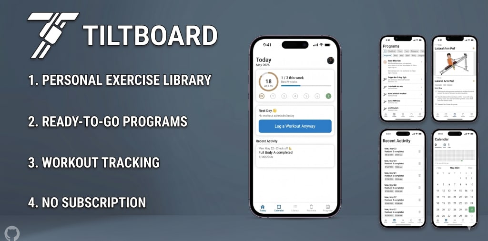

# Tiltboard

**The workout companion built for your sliding bench trainer.**

If you own a Total Gym, Gr8flex, Weider Ultimate Body Works, or similar sliding bench trainer, you know the feeling: you've got a manual full of exercises, but no real plan for putting them together — and no easy way to stay consistent over time. Tiltboard fixes that.

Install it on your phone like any other app, and you've got everything you need to build a routine, follow a program, and actually stick with it.

---

## What You Get

### A Complete Exercise Library
Every exercise your machine can do, right in your pocket. Browse all 70+ exercises with animated demonstrations, step-by-step form tips, and filtering by muscle group or movement type. Mark your favorites for quick access.

### Ready-to-Go Programs
Not sure where to start? Choose from built-in weekly programs — beginner three-days-a-week, intermediate upper/lower splits, and more. Each program tells you exactly what to do and when. You can also build your own from scratch or tweak any program to fit your schedule.

### Track Workouts Your Way
You choose how much detail you want:

- **Quick check-off** — Tap to log that you worked out today. That's it. Takes three seconds.
- **Guided mode** — Walk through your routine step by step. Log your reps, incline level, and rest between sets with a built-in timer (your phone will even vibrate when rest time is up).

### Stay Motivated with Streaks
Tiltboard tracks how many weeks in a row you've hit your workout goal. Hit your target workouts this week? Your streak lives. The goal isn't perfection — it's consistency. The app shows your current streak, your all-time best, and a full year of workout history at a glance so you can see how far you've come.

### Visual Themes
Choose the look that fits your vibe: dark gym style, clean light mode, warm journal feel, or auto (follows your phone's settings).

---

## Your Data Stays With You

No account needed. No subscription. No cloud. Everything is stored on your phone. You can back up your data anytime by exporting it as a file, and restore it just as easily.  Full support for backup / restore on your streak & historical data, custom exercises, routines, and programs.  Ability to share custom workouts, exercises, and programs with others (without overwriting their historical data).

---

## Installing on Your Phone

Tiltboard is a web app that installs directly onto your home screen — no app store required.  Just visit [Tiltboard on the web](https://msalty.github.io/tiltboard/) and install it on your phone using the directions below - it's that easy.

**On iPhone (Safari):**
1. Open the app in Safari
2. Tap the Share button at the bottom of the screen
3. Tap "Add to Home Screen"
4. Tap "Add"

**On Android (Chrome):**
1. Open the app in Chrome
2. Tap the three-dot menu in the top right
3. Tap "Add to Home Screen" or "Install App"
4. Tap "Install"

Once installed, Tiltboard works just like a native app — and it works offline too, so your workouts are never interrupted by a spotty connection or lack of internet.  

All data is stored on your device and the app is free to use forever - that's a deal that's hard to beat.  If you like it, hit the link above to buy me a coffee.  Hope you enjoy.  

Report any issues or feature requests here: https://github.com/msalty/tiltboard/issues

---

Built for sliding bench trainers. Designed for real life.

---

## Disclaimer

[Tiltboard](https://msalty.github.io/tiltboard/) is an independent app and is not affiliated with, endorsed by, or connected to any sliding bench trainer manufacturer.

Total Gym is a registered trademark of Total Gym Global Corp. Gr8flex is a registered trademark of Gr8flex USA. Weider and Weider Ultimate Body Works are registered trademarks of iFIT Health & Fitness, Inc. Marcy is a registered trademark of Marcy Fitness Products. Stamina is a registered trademark of Stamina Products, Inc.

All other brand names and product names mentioned are trademarks or registered trademarks of their respective owners.

